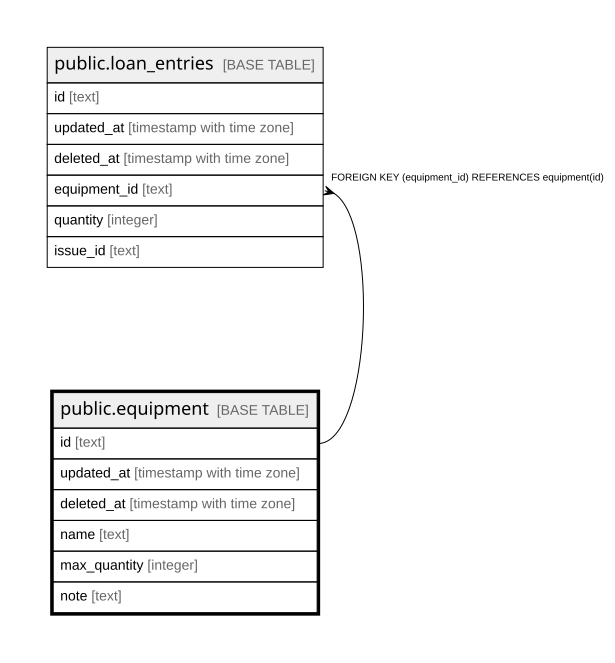

# public.equipment

## Description

## Columns

| Name | Type | Default | Nullable | Children | Parents | Comment |
| ---- | ---- | ------- | -------- | -------- | ------- | ------- |
| id | text |  | false | [public.loan_entries](public.loan_entries.md) |  |  |
| updated_at | timestamp with time zone |  | true |  |  |  |
| deleted_at | timestamp with time zone |  | true |  |  |  |
| name | text |  | false |  |  |  |
| max_quantity | integer |  | false |  |  |  |
| note | text |  | false |  |  |  |

## Constraints

| Name | Type | Definition |
| ---- | ---- | ---------- |
| equipment_pkey | PRIMARY KEY | PRIMARY KEY (id) |

## Indexes

| Name | Definition |
| ---- | ---------- |
| equipment_pkey | CREATE UNIQUE INDEX equipment_pkey ON public.equipment USING btree (id) |
| idx_equipment_deleted_at | CREATE INDEX idx_equipment_deleted_at ON public.equipment USING btree (deleted_at) |

## Relations

---

> Generated by [tbls](https://github.com/k1LoW/tbls)
