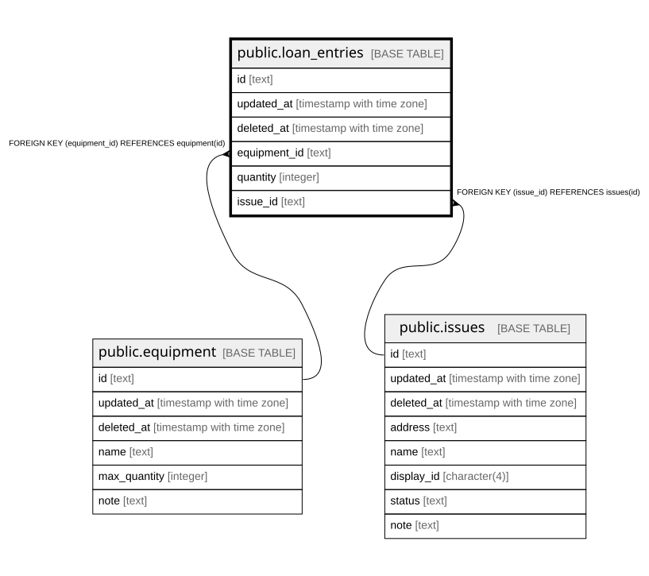

# public.loan_entries

## Description

## Columns

| Name | Type | Default | Nullable | Children | Parents | Comment |
| ---- | ---- | ------- | -------- | -------- | ------- | ------- |
| id | text |  | false |  |  |  |
| updated_at | timestamp with time zone |  | true |  |  |  |
| deleted_at | timestamp with time zone |  | true |  |  |  |
| equipment_id | text |  | false |  | [public.equipment](public.equipment.md) |  |
| quantity | integer |  | false |  |  |  |
| issue_id | text |  | false |  | [public.issues](public.issues.md) |  |

## Constraints

| Name | Type | Definition |
| ---- | ---- | ---------- |
| fk_issues_loan_entries | FOREIGN KEY | FOREIGN KEY (issue_id) REFERENCES issues(id) |
| fk_loan_entries_equipment | FOREIGN KEY | FOREIGN KEY (equipment_id) REFERENCES equipment(id) |
| loan_entries_pkey | PRIMARY KEY | PRIMARY KEY (id) |

## Indexes

| Name | Definition |
| ---- | ---------- |
| loan_entries_pkey | CREATE UNIQUE INDEX loan_entries_pkey ON public.loan_entries USING btree (id) |
| idx_loan_entries_deleted_at | CREATE INDEX idx_loan_entries_deleted_at ON public.loan_entries USING btree (deleted_at) |

## Relations

---

> Generated by [tbls](https://github.com/k1LoW/tbls)
