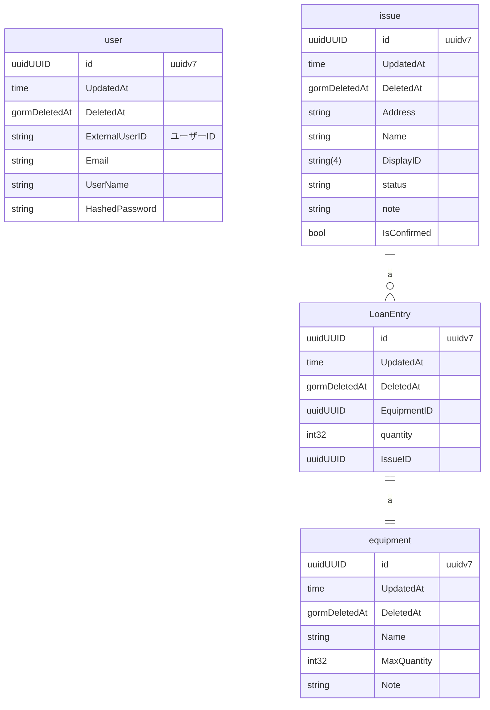

```mermaid
erDiagram
 %% base {
 %%   uuidUUID id "uuidv7"
 %%   time UpdatedAt
 %%   gormDeletedAt DeletedAt
 %% }

  user {
    uuidUUID id "uuidv7"
    time UpdatedAt
    gormDeletedAt DeletedAt
    string ExternalUserID "ユーザーID"
    string Email
    string UserName
    string HashedPassword
  }

  equipment {
    uuidUUID id "uuidv7"
    time UpdatedAt
    gormDeletedAt DeletedAt
    string Name
    int32 MaxQuantity
    string Note
  }

  issue {
    uuidUUID id "uuidv7"
    time UpdatedAt
    gormDeletedAt DeletedAt
    string Address
    string Name
    string(4) DisplayID
    string status
    string note
    bool IsConfirmed
  }

  LoanEntry {
    uuidUUID id "uuidv7"
    time UpdatedAt
    gormDeletedAt DeletedAt
    uuidUUID EquipmentID
    int32 quantity
    uuidUUID IssueID
  }

  issue ||--o{ LoanEntry : "a"
  LoanEntry ||--|| equipment : "a"
```
