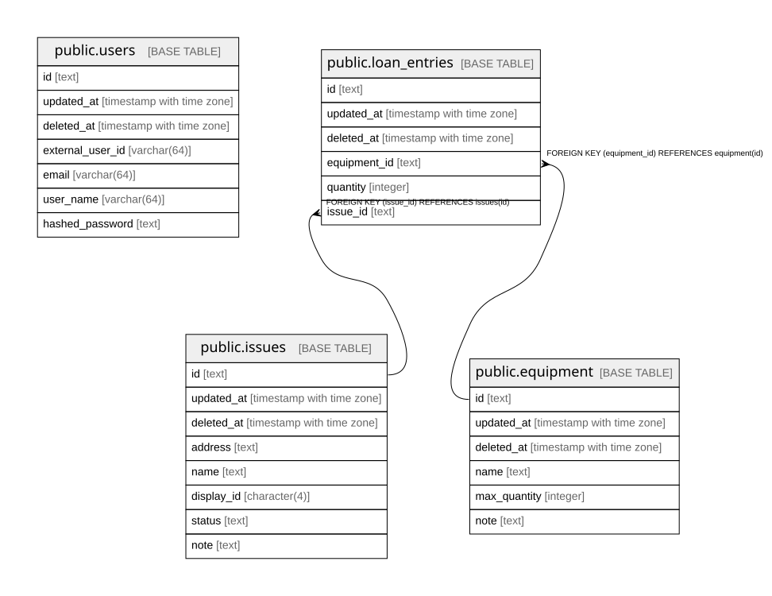

# klend

## Description

klend-backend's database

## Tables

| Name                                          | Columns | Comment                  | Type       |
| --------------------------------------------- | ------- | ------------------------ | ---------- |
| [public.users](public.users.md)               | 7       | ユーザーテーブル                 | BASE TABLE |
| [public.issues](public.issues.md)             | 8       | column comment required. | BASE TABLE |
| [public.equipment](public.equipment.md)       | 6       | column comment required. | BASE TABLE |
| [public.loan_entries](public.loan_entries.md) | 6       | column comment required. | BASE TABLE |

## Relations

---

> Generated by [tbls](https://github.com/k1LoW/tbls)
