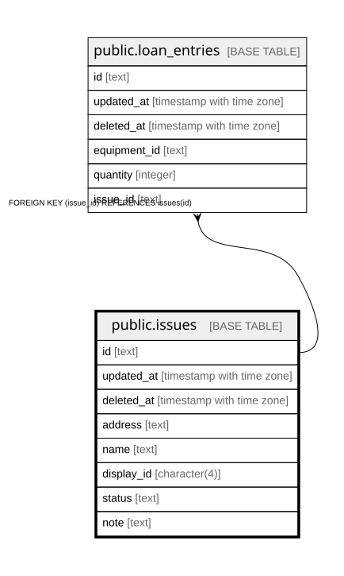

# public.issues

## Description

column comment required.

## Columns

| Name | Type | Default | Nullable | Children | Parents | Comment |
| ---- | ---- | ------- | -------- | -------- | ------- | ------- |
| id | text |  | false | [public.loan_entries](public.loan_entries.md) |  |  |
| updated_at | timestamp with time zone |  | true |  |  | column comment required. |
| deleted_at | timestamp with time zone |  | true |  |  | column comment required. |
| address | text |  | false |  |  | column comment required. |
| name | text |  | false |  |  | column comment required. |
| display_id | character(4) |  | true |  |  | column comment required. |
| status | text |  | false |  |  | column comment required. |
| note | text |  | false |  |  | column comment required. |

## Constraints

| Name | Type | Definition |
| ---- | ---- | ---------- |
| issues_pkey | PRIMARY KEY | PRIMARY KEY (id) |

## Indexes

| Name | Definition |
| ---- | ---------- |
| issues_pkey | CREATE UNIQUE INDEX issues_pkey ON public.issues USING btree (id) |
| idx_issues_deleted_at | CREATE INDEX idx_issues_deleted_at ON public.issues USING btree (deleted_at) |

## Relations

---

> Generated by [tbls](https://github.com/k1LoW/tbls)
