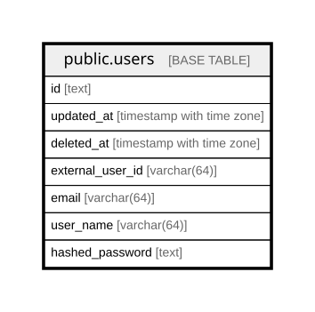

# public.users

## Description

ユーザーテーブル

## Columns

| Name             | Type                     | Default | Nullable | Comment                          |
| ---------------- | ------------------------ | ------- | -------- | -------------------------------- |
| id               | text                     |         | false    |                                  |
| updated_at       | timestamp with time zone |         | true     | 更新日時                             |
| deleted_at       | timestamp with time zone |         | true     | 削除日時                             |
| external_user_id | varchar(64)              |         | false    | ユーザーID                           |
| email            | varchar(64)              |         | false    | メールアドレス                          |
| user_name        | varchar(64)              |         | false    | ユーザー名 256文字以内                    |
| hashed_password  | text                     |         | false    | argon2でハッシュ化されたpassword          |

## Constraints

| Name       | Type        | Definition       |
| ---------- | ----------- | ---------------- |
| users_pkey | PRIMARY KEY | PRIMARY KEY (id) |

## Indexes

| Name                       | Definition                                                                                    |
| -------------------------- | --------------------------------------------------------------------------------------------- |
| users_pkey                 | CREATE UNIQUE INDEX users_pkey ON public.users USING btree (id)                               |
| idx_users_user_name        | CREATE UNIQUE INDEX idx_users_user_name ON public.users USING btree (user_name)               |
| idx_users_email            | CREATE UNIQUE INDEX idx_users_email ON public.users USING btree (email)                       |
| idx_users_external_user_id | CREATE UNIQUE INDEX idx_users_external_user_id ON public.users USING btree (external_user_id) |
| idx_users_deleted_at       | CREATE INDEX idx_users_deleted_at ON public.users USING btree (deleted_at)                    |

## Relations

---

> Generated by [tbls](https://github.com/k1LoW/tbls)
